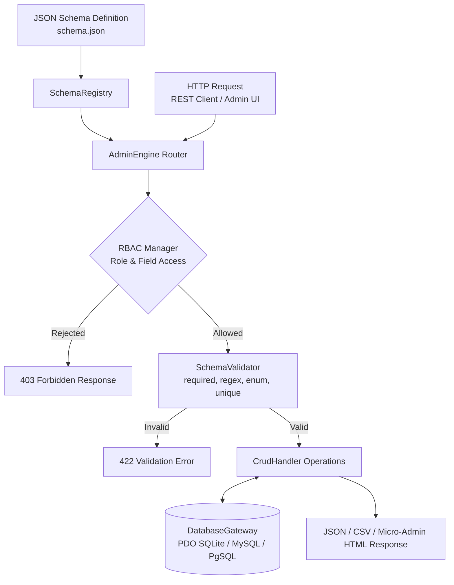

[🇸🇦 العربية](README.ar.md) | [🇬🇧 English](README.md)

# 🎛️ eidcloud-headless-admin

[](https://github.com/eidcloud/eidcloud-headless-admin/releases)
[](https://www.php.net/)
[](LICENSE)
[](https://colab.research.google.com/github/eidcloud/eidcloud-headless-admin/blob/main/notebooks/quickstart.ipynb)

> **Metadata-driven headless administration engine generating instant CRUD APIs and RBAC permissions in pure PHP 8.2+ with zero external vendor dependencies.**

---

## 📌 Topics
`eidcloud` • `headless-admin` • `crud-engine` • `admin-panel` • `rbac` • `schema-driven` • `php8`

---

## 🏗️ Architecture & Engine Flow



---

## ✨ Key Capabilities

- **Zero-Dependency Architecture**: 100% Pure PHP 8.2+ with no external composer vendor bloat, heavyweight MVC, or bloated ORMs (EIDFM philosophy).
- **JSON Schema-Driven**: Describe tables, field types, validation rules, permissions, and relationships declaratively in standard JSON.
- **Instant RESTful CRUD Endpoints**:
  - `GET /api/{module}` - List with full-text search, column filters, pagination, and multi-column sorting.
  - `GET /api/{module}/{id}` - Retrieve single record with field-level visibility filtering.
  - `POST /api/{module}` - Validate payload, enforce write RBAC, insert record.
  - `PUT /api/{module}/{id}` - Partial/full update with automated duplicate & unique validation.
  - `DELETE /api/{module}/{id}` - Role-controlled deletion.
  - `GET /api/{module}/export` - Stream dynamic CSV exports honoring field read restrictions.
- **Dynamic Field-Level RBAC**: Enforce granular role policies on both module actions and individual database columns.
- **Schema Validation Rules**: Automated enforcement of `required`, `min`, `max`, `regex`, `unique`, and `enum` constraints.
- **Embedded Micro-Admin UI**: Beautiful, lightweight built-in web management interface accessible at `/admin`.
- **CLI Tool (`bin/eidcloud-admin`)**:
  - `serve`: Launch instant HTTP dev server with schema and live admin UI.
  - `generate-module`: Reverse engineer existing SQL tables into ready-to-use module JSON schemas.
  - `validate`: Validate schema structure and integrity rules.

---

## 🚀 Installation & Quick Start

### 1. Requirements
- PHP 8.2 or higher
- PDO extension (`pdo_sqlite`, `pdo_mysql`, or `pdo_pgsql`)

### 2. Standalone Autoloader or Composer
```json
{
    "require": {
        "eidcloud/headless-admin": "^1.0"
    }
}
```

Or clone and run directly:
```bash
git clone https://github.com/eidcloud/eidcloud-headless-admin.git
cd eidcloud-headless-admin
```

---

## 🛠️ CLI Usage

```bash
# Display help and command options
php bin/eidcloud-admin --help

# Start the built-in development server and Admin UI on port 8090
php bin/eidcloud-admin serve examples/schema.json --port=8090

# Reverse engineer an existing table into schema JSON
php bin/eidcloud-admin generate-module --table=customers --db="sqlite:data.db" --out=customers.json

# Validate a schema file
php bin/eidcloud-admin validate examples/schema.json
```

---

## 💡 Programmatic Usage

```php
<?php

require_once 'src/autoload.php';

use EidCloud\HeadlessAdmin\AdminEngine;
use EidCloud\HeadlessAdmin\Metadata\SchemaRegistry;

// 1. Load Schema Registry
$registry = SchemaRegistry::fromFile('examples/schema.json');

// 2. Instantiate Engine with PDO connection (or SQLite file)
$engine = new AdminEngine(
    registry: $registry,
    database: 'sqlite:data.db',
    apiPrefix: '/api'
);

// 3. Dispatch incoming HTTP request and emit response
$response = $engine->handle();
$response->send();
```

---

## 🧪 Automated Testing

Run the zero-dependency test suite:
```bash
php tests/run_tests.php
```

---

## 👤 Author & Maintainer

**Eng. MHD. Shadi AL-Hasan**  
- **Role:** Executive CTO & Enterprise Solutions Architect  
- **Email:** [mhd.shadi.alhasan@gmail.com](mailto:mhd.shadi.alhasan@gmail.com)  
- **Phone / WhatsApp:** [+963934005922](tel:+963934005922)  
- **Location:** Damascus, Syria  
- **GitHub:** [shadialhasan](https://github.com/shadialhasan)  

---

## 📄 License

This project is licensed under the MIT License - see the [LICENSE](LICENSE) file for details.  
Copyright (c) 2026 **MHD. Shadi AL-Hasan**. All rights reserved.
